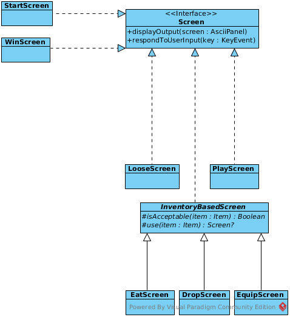

# Design document 

## Игровой процесс

Игрок просыпается в аду, которое похоже на случайно сгенерированное подземелье.

Последнее, что он помнит - это то, что в девятом кругу ада валяется его зачетка, и ему нужно пройти весь путь туда и обратно, чтобы достать её.

Подземелье представляет несколько этажей пещер, соединеенных друг с другом лестницами, по которым может перемещаться герой.

По подземельям разбросаны некоторые предметы (такие, как камни, броня/оружие), зелья для лечения.

Подземелья кишат летучими мышами и зелеными грибами. 

Летучие мыши слепые, но больно кусаются.

Зеленые грибы светятся в темноте и ничего не делают.

### Боевая система

Каждое существо обладает некоторым количеством здоровья, а также такими характеристиками как "сила атаки" и "уровень защиты". 

Когда здоровье достигает нуля, существо погибает.

Существо может экипировать один предмет брони и один предмет оружия - соответсвенно, они увеличат его атаку и защиту соответственно.

Существо атакует любое другое существо не своего вида, если оно стоит там, куда существо хочет идти. Количество нанесенного урона рассчитывается по формуле `(attackValue - target.defenseValue) * random(0, 1) + 1` (отрицательный урон не наносится, конечно же).

### Экипировка

В подземелье разбросаны предметы, и игрок может подбирать их клавишами `,` или `g`, стоя над ними. Если в инвентаре есть место, то предмет будет подобран.

У каждого предмета есть три характеристики:

* `attackValue` - то, какой бонус будет получен при использовании этого предмета как оружия;
* `defenseValue` - то, сколько дополнительной защиты даст этот предмет, если его надеть;
* `foodValue` - то, сколько здоровья восстановит этот предмет, если его съесть.

Не существует предметов, которые одновременно были бы и оружием, и одеждой; тем не менее, могут существовать предметы, которые можно и съесть, и использовать как-то по-другому (например, тако :taco:).

В игре есть специальный предмет, называющийся `ZACHETKA`, который лежит на самом глубоком уровне лабиринта. 

### Экраны

В игре есть несколько экранов:

* стартовый экран, откуда можно перейти в игру;
* игровой экран, откуда можно перейти в следующие экраны:
    * экран выбора экипировки (`W`);
    * экран поедания предметов (`E`);
    * экран выброса предметов (`D`).
    
    Каждый из этих экранов позволяет по нажатию клавиши, ассоциированной с конкретным предметом, выбросить его в ближайшую свободную клетку;
* экраны победы/поражения.

## Диаграмма компонентов

Основную роль у правлении играют классы `PlayScreen` (коммуникация между игроком и системой), `PlayerAI` (логика действий игрока с миром) и `World` (представление мира).

Фактически, `World`-`AsciiTerminal`-`PlayerScreen` являют собой троицу Model-View-Controller.

## Sequence-diagram взаимодействия с игроком

Класс PlayerScreen получает нажатую пользователем клавишу, после чего интерпретирует её как указание к действию персонажа и передает её персонажу `player`.

Классы для взаимодействия с инвентарем (наследники `InventoryBasedScreen`) отдают персонажу команды `eat, equip/unequip`.

`player` получает команду и либо сам её обрабатывает, либо передает `PlayerAi` (если команда неоднозначная, например, нужно либо атаковать кого-то, либо куда-то пойти).

`CreatureAI` играет не так много значения в случае с самим игроком, но полностью контролирует мобов (летучих мышей). 

<!---->

## Диаграммы классов

### Наследники класса Screen

### Классы для представления окружения

### Классы для представления и управления персонажами

